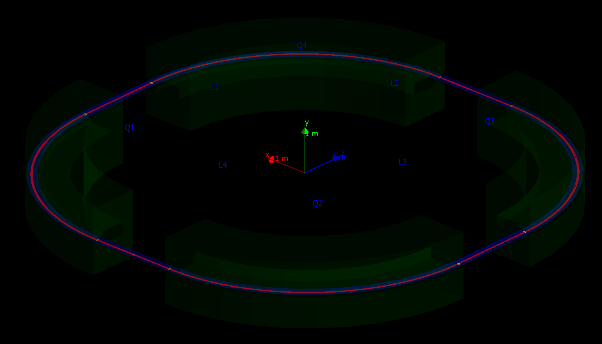

### LPI_Pakhra

# Необходимая конфигурация для запуска:

geant4 10.05.p01

Qt 5.13.1

xerces-c 3.2

Qt служит для визуализации

xerces-c необходим для парсинга GDML моделей

# Цветовое описание элементов

Красный - магнит

Синий - вакуумная камера

Жёлтый - объём для вакуума

